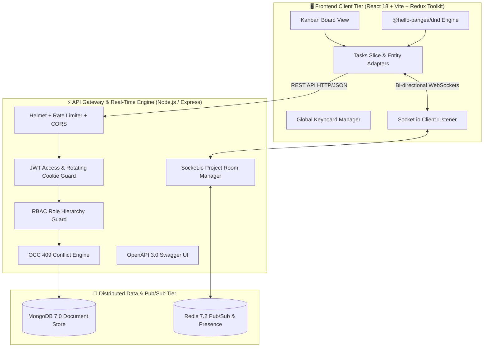
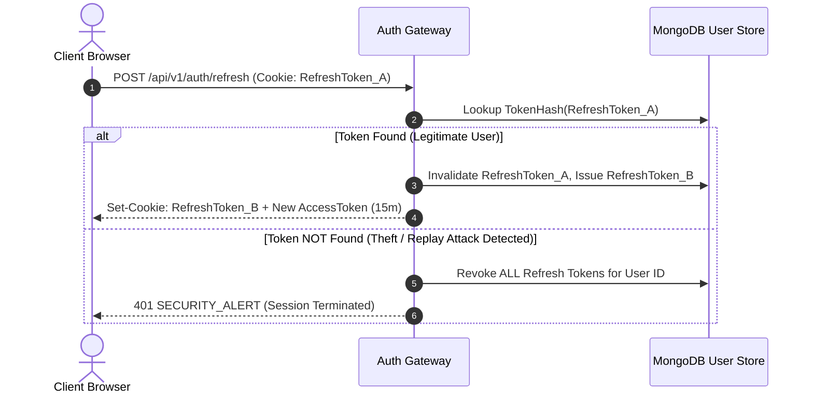

# ⚡ Jira-Lite — Real-Time Collaborative Kanban Workspace

<div align="center">


-brightgreen?style=for-the-badge&logo=jest&logoColor=white)


**A high-concurrency, enterprise-grade, real-time collaborative Kanban project management platform.**  
Engineered with distributed systems principles, **$O(1)$ Fractional Indexing**, **Optimistic Concurrency Control (OCC)**, **Multi-Room WebSocket Synchronization with Redis Pub/Sub**, and **Zero-Latency (0ms) Optimistic UI Updates**.

[Live Demo](#-quickstart--local-setup) • [Architecture Deep Dive](#-architecture--distributed-systems-design) • [API Documentation](#-api-documentation--swagger-openapi-30) • [Test Coverage](#-automated-testing-suites-88-passing-tests)

</div>

---

## 🌟 Executive Summary & Engineering Highlights

Jira-Lite is a production-hardened fullstack workspace engineered to solve the complex concurrency and distributed synchronization challenges present in modern agile trackers (like Jira, Linear, and Trello):

- 🔄 **0ms Optimistic UI with Auto-Rollback**: Card drag-and-drop operations update the user's viewport in `0ms` via Redux Toolkit entity adapters, with automatic rollback if network failure occurs.
- 🔢 **$O(1)$ Fractional Midpoint Reordering**: Avoids costly $O(N)$ database index re-writes during card reordering using midpoint math algorithm `(before + after) / 2`.
- 🛡️ **Optimistic Concurrency Control (OCC)**: Enforces document `version` counter increments on every update, rejecting stale mid-air collisions with `409 VERSION_CONFLICT`.
- 📡 **Distributed Real-Time Engine (Socket.io + Redis)**: Room-based broadcast synchronization with sender-skip (`x-socket-id`), live presence avatars, and typing indicators.
- 🔐 **Zero-Trust Security & Token Theft Detection**: 15-minute JWT access tokens coupled with 7-day rotating HTTP-Only refresh cookies. If a consumed refresh token is presented again, all active sessions are instantly revoked.
- 📊 **Executive Analytics & Multi-Criteria Filtering**: Dynamic WIP limit adherence metrics, workload distribution by assignees, overdue task tracking, and multi-label search.
- 📦 **RFC 4180 CSV & JSON Batch Ingestion**: High-throughput export and bulk task import engine with automatic atomic sequential key assignment (`PROJ-1`, `PROJ-2`).
- ⌨️ **Global Keyboard Hotkey Navigation**: Power-user keyboard workflow (`/` search, `C`/`N` create, `M` multi-select, `T` theme switch, `Del` bulk delete, `?` guide).

---

## 🏛️ Architecture & Distributed Systems Design

### High-Level System Topology



---

## 🔬 Algorithmic Deep Dives

### 1. Fractional Midpoint Indexing ($O(1)$ Drag & Drop)
Traditional Kanban implementations update the `position` index of every card below the dropped card ($O(N)$ write amplification). Jira-Lite uses fractional midpoint indexing:

$$\text{newPosition} = \frac{\text{before.position} + \text{after.position}}{2}$$

- **Empty Column**: $\text{position} = 1024$
- **Append to End**: $\text{position} = \text{lastCard.position} + 1024$
- **Insert at Top**: $\text{position} = \frac{\text{firstCard.position}}{2}$
- **Insert Between Two Cards**: Midpoint between neighbors.

### 2. Token Reuse & Theft Detection Flow


---

## 🗺️ 12-Week Roadmap Deliverables Matrix

| Phase | Git Tag | Module Name | Key Engineering Accomplishments |
| :---: | :---: | :--- | :--- |
| **Week 1** | `v0.1` | **Monorepo & Foundation** | Monorepo structure, Zod env validation, 5 ADRs, ERD schemas, fractional position math |
| **Week 2** | `v0.2` | **Auth & Security Guard** | JWT 15m access token + 7d rotating cookie, Token Reuse & Theft Detection, Rate Limiting, RBAC rank hierarchy |
| **Week 3** | `v0.3` | **Projects & Workflows** | Multi-project workspace, custom columns with WIP limits, member invites, column deletion safety guards |
| **Week 4** | `v0.4` | **Tasks & Concurrency** | Atomic sequence keys (`KEY-1`), Midpoint reordering, OCC (`409 VERSION_CONFLICT`), soft deletion |
| **Week 5** | `v0.5` | **Frontend Architecture** | React Router v7, silent auth recovery on boot, Redux Entity Adapters, auth forms & project dashboard |
| **Week 6** | `v0.6` | **Kanban Drag & Drop** | `@hello-pangea/dnd` Kanban board, 0ms optimistic updates with automatic rollback, Task detail modal |
| **Week 7** | `v0.7` | **Real-Time Collaboration**| Socket.io project rooms, sender-skip (`x-socket-id`), live presence avatars, typing indicators |
| **Week 8** | `v0.8` | **Comments & Audit Trail** | Threaded comments, `@mentions`, append-only activity audit stream, in-app notification center with unread badges |
| **Week 9** | `v0.9` | **Filters & Analytics** | Multi-criteria filters (labels, priority, assignees, overdue), project settings modal, Executive Analytics |
| **Week 10** | `v0.10`| **Import/Export & Bulk** | RFC 4180 CSV/JSON export & batch ingestion, multi-select toolbar (bulk move, bulk priority, bulk delete) |
| **Week 11** | `v0.11`| **Hotkeys & Theme Engine** | Global keyboard hotkeys (`/`, `C`, `N`, `M`, `?`, `Esc`, `Del`), Dark/Light mode theme engine, Route code-splitting |
| **Week 12** | `v1.0` | **Production & CI/CD** | Swagger OpenAPI 3.0 (`/api/docs`), multi-stage Dockerfiles, Docker Compose stack, GitHub Actions CI/CD matrix |

---

## ⌨️ Keyboard Shortcuts Reference

| Key Combo | Action Description | Scope |
| :---: | :--- | :--- |
| <kbd>/</kbd> | Instant focus to Board Search input | Board View |
| <kbd>C</kbd> or <kbd>N</kbd> | Open Quick Task Creation modal | Board View |
| <kbd>M</kbd> | Toggle Multi-Select Card Selection Mode | Board View |
| <kbd>Del</kbd> or <kbd>Backspace</kbd> | Trigger Bulk Deletion for selected cards | Selection Mode |
| <kbd>T</kbd> | Toggle Dark ☀️ / Light 🌙 Mode Theme | Global |
| <kbd>?</kbd> | Show Keyboard Shortcuts Cheat Sheet modal | Global |
| <kbd>Esc</kbd> | Dismiss active modal or clear card selection | Global |

---

## 🛠️ Complete Tech Stack

```
Frontend:
├── React 18.3 (SPA)
├── Redux Toolkit + Entity Adapters (State Management)
├── React Router v7 (Client-Side Navigation)
├── TailwindCSS 3.4 + Custom Design Tokens (Styling)
├── @hello-pangea/dnd (Smooth Drag & Drop)
├── Lucide React (Icons)
└── Vite 6 (Bundle Engine & Code Splitting)

Backend & Database:
├── Node.js 20+ (Runtime)
├── Express.js 4 (REST API Gateway)
├── Socket.io 4.8 (Real-Time Bidirectional Event Engine)
├── MongoDB 7.0 + Mongoose 8 (Document Database)
├── Redis 7.2 (Pub/Sub & Presence Tracking)
├── Zod 3.24 (Type Validation & Env Verification)
└── Swagger UI Express (OpenAPI 3.0 Documentation)

DevOps & Quality Assurance:
├── Docker & Docker Compose (Multi-Container Orchestration)
├── Nginx 1.27 Alpine (Static SPA Reverse Proxy)
├── GitHub Actions (CI/CD Automated Test Matrix)
├── Jest 29 + Supertest (Backend Testing - 78 Tests)
└── Vitest 3 (Frontend Component & Redux Testing - 10 Tests)
```

---

## 🚀 Quickstart & Local Setup

### 1. Run with Docker Compose (Recommended)

```bash
# 1. Clone repository
git clone https://github.com/aadarsh2006ak/Real-Time-Collaborative-Workspace-Kanban-Tracker-Jira-Lite-.git
cd Real-Time-Collaborative-Workspace-Kanban-Tracker-Jira-Lite-

# 2. Boot production stack (MongoDB, Redis, Express API, Nginx Client)
docker compose -f docker-compose.prod.yml up --build -d

# 3. Seed Demo Data inside container
docker exec -it jira_server_prod npm run seed
```

- 🌐 **Web Client**: [http://localhost:3000](http://localhost:3000)
- 📖 **Swagger API Documentation**: [http://localhost:5000/api/docs](http://localhost:5000/api/docs)

### 2. Run in Local Development Mode

```bash
# Install all monorepo dependencies
npm install

# Start Backend Server (Terminal 1)
cd server
npm run dev

# Start Frontend Client (Terminal 2)
cd ../client
npm run dev
```

Open [http://localhost:5173](http://localhost:5173) in your browser.

---

## 🔑 Pre-Seeded Demo Login Credentials

| Attribute | Value |
| :--- | :--- |
| **Work Email** | `siddharth@example.com` |
| **Password** | `Password123!` |
| **Demo Project** | `Engineering Platform (EP)` |
| **Pre-populated Cards** | 6 Realistic Workflow Tasks across 4 Columns |

*(Or click **"Fill Demo Credentials"** on the Login screen).*

---

## 🧪 Automated Testing Suites (88 Passing Tests)

### Backend Test Suite (Jest — 78 Tests)
```bash
cd server
npm test
```
```
PASS tests/export_import_bulk.test.js
PASS tests/auth.test.js
PASS tests/task.test.js
PASS tests/project.test.js
PASS tests/socket.test.js
PASS tests/comments_activity_notifications.test.js
PASS tests/analytics_and_filters.test.js
PASS tests/health.test.js
PASS tests/position.test.js

Test Suites: 9 passed, 9 total
Tests:       78 passed, 78 total
Snapshots:   0 total
Time:        22.6 s
```

### Frontend Test Suite (Vitest — 10 Tests)
```bash
cd client
npm test -- --run
```
```
 ✓ src/features/ui/uiSlice.test.js (5 tests)
 ✓ src/features/tasks/tasksSlice.test.js (5 tests)

Test Files  2 passed (2)
Tests       10 passed (10)
```

---

## 📖 API Documentation & Swagger OpenAPI 3.0

Interactive Swagger UI documentation is available at **`http://localhost:5000/api/docs`** and covers:

- `POST /api/v1/auth/register` & `POST /api/v1/auth/login`
- `POST /api/v1/auth/refresh` (Rotating Token Theft Guard)
- `GET /api/v1/projects` & `POST /api/v1/projects`
- `GET /api/v1/projects/:projectId/tasks` (Multi-Filter & Search)
- `PATCH /api/v1/tasks/:taskId/move` (Fractional Reordering)
- `GET /api/v1/projects/:projectId/export` (CSV RFC 4180 / JSON)
- `POST /api/v1/projects/:projectId/import` (Batch Ingestion)
- `POST /api/v1/projects/:projectId/tasks/bulk-move`
- `POST /api/v1/projects/:projectId/tasks/bulk-delete`
- `POST /api/v1/projects/:projectId/tasks/bulk-update`
- `GET /api/v1/projects/:projectId/analytics` (Executive Dashboard Metrics)

---

## 📄 Architectural Decision Records (ADRs)

Key architectural decisions are documented in [`docs/adr/`](docs/adr/):
- **`ADR 0001`**: Fractional Indexing for O(1) Task Ordering
- **`ADR 0002`**: Optimistic Concurrency Control (OCC) Version Counters
- **`ADR 0003`**: Rotating Refresh Tokens with Theft & Reuse Detection
- **`ADR 0004`**: Distributed Redis Pub/Sub for Multi-Node Socket.io Sync
- **`ADR 0005`**: Monorepo Workspaces & Automated CI/CD Pipeline

---

## 👨‍💻 Author & Contribution

Developed with ❤️ by **Aadarsh Kumar**.  
- **GitHub**: [@aadarsh2006ak](https://github.com/aadarsh2006ak)
- **Repository**: [Real-Time-Collaborative-Workspace-Kanban-Tracker-Jira-Lite-](https://github.com/aadarsh2006ak/Real-Time-Collaborative-Workspace-Kanban-Tracker-Jira-Lite-)

---

## 📜 License
This project is open source and licensed under the [MIT License](LICENSE).
