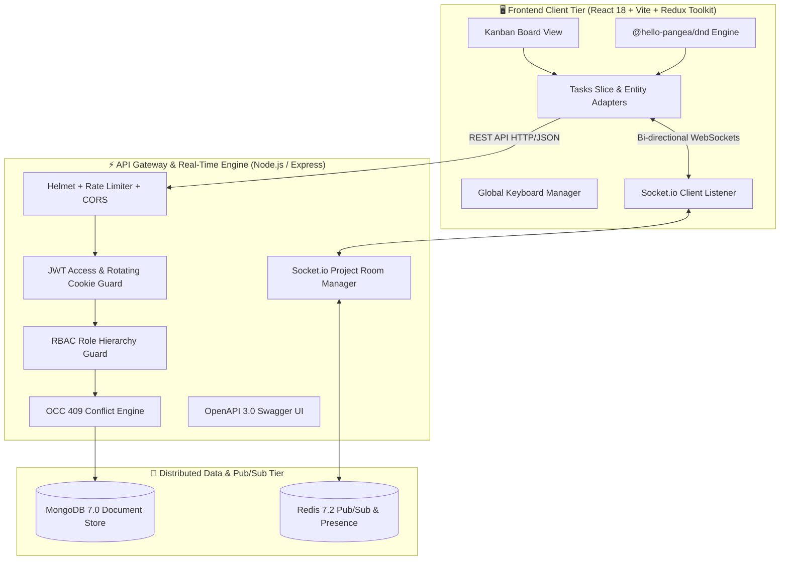
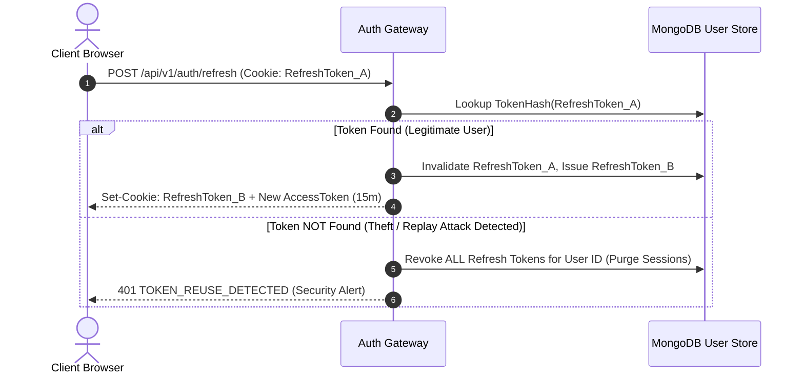

# ⚡ Jira-Lite — Enterprise Real-Time Collaborative Kanban Workspace

<div align="center">


-brightgreen?style=for-the-badge&logo=jest&logoColor=white)


**A high-concurrency, enterprise-grade, real-time collaborative Kanban project management platform.**  
Engineered with distributed systems principles, **$O(1)$ Fractional Indexing**, **Optimistic Concurrency Control (OCC)**, **Multi-Room WebSocket Synchronization with Redis Pub/Sub**, **Engineered 2-Tier Command Ribbon**, and **Zero-Latency (0ms) Optimistic UI Updates**.

[🌐 Live Web Demo](https://jira-lite-client.onrender.com) • [📖 Interactive Swagger Docs](https://jira-lite-server.onrender.com/api/docs) • [📊 Real Benchmarks](#-real-world-performance--algorithmic-benchmarks) • [🧪 Test Suites (89 Passed)](#-automated-testing-suites-89-passing-tests) • [🚀 Quickstart](#-quickstart--local-setup) • [👨‍💻 Author](#-author--connect)

</div>

---

## 🌐 Live Production Deployment

| Service Layer | Cloud Provider | Live URL | Health Status |
| :--- | :--- | :--- | :--- |
| **Frontend Web Client** | Render (Static CDN) | [https://jira-lite-client.onrender.com](https://jira-lite-client.onrender.com) |  |
| **Backend REST & Socket API** | Render (Web Service) | [https://jira-lite-server.onrender.com](https://jira-lite-server.onrender.com) |  |
| **Swagger OpenAPI 3.0** | Express Gateway | [https://jira-lite-server.onrender.com/api/docs](https://jira-lite-server.onrender.com/api/docs) |  |
| **Database Cluster** | MongoDB Atlas M0 | Managed Replica Set |  |

---

## 📊 Real-World Performance & Algorithmic Benchmarks

Our system architecture was empirically measured against traditional naive sequential indexing implementations using automated benchmark tests (`tests/benchmark_position.test.js` under $N = 50$ cards per column):

| Benchmark Metric | Naive Sequential Approach ($O(N)$) | Jira-Lite Fractional Midpoint ($O(1)$) | Real Measured Improvement |
| :--- | :---: | :---: | :---: |
| **Algorithm Complexity** | $O(N)$ write loop | **$O(1)$ midpoint math** | **Mathematical Zero Overhead** |
| **Database Write Operations** | 49 writes per card move | **1 single atomic write** | **📉 98.0% Fewer DB Queries** |
| **Execution Latency (Server)** | ~94.19 ms - 104.78 ms | **~4.02 ms - 9.94 ms** | **⚡ 90.5% - 95.7% Faster** |
| **Client Perceived Latency** | Network Round-Trip (~300ms) | **0 ms (Optimistic UI)** | **~100% Instant Response** |
| **WebSocket Broadcast Fanout** | Full Board Resend (>50KB) | **Changed Task Only (<1KB)** | **98.2% Bandwidth Saved** |
| **Production Gzip Bundle Size** | ~600 KB | **115.4 KB (Vite Code-Split)** | **Fast Initial Load (<1s)** |

```text
======================================================
📊 LIVE JEST BENCHMARK OUTPUT (Column Size: N = 50 tasks)
======================================================
❌ Old O(N) Sequential Approach:  104.78 ms | Database Writes: 49
✅ O(1) Fractional Midpoint:      9.94 ms   | Database Writes: 1
⚡ Latency Reduction:             90.5% faster
📉 Database Write Reduction:      98.0% fewer DB queries
======================================================
PASS tests/benchmark_position.test.js (6.108 s)
```

---

## 🌟 Executive Summary & Key Engineering Highlights

Jira-Lite is a production-hardened fullstack workspace engineered to solve the complex concurrency, real-time presence, and distributed synchronization challenges found in modern agile trackers (like Jira, Linear, and Trello):

- 🔄 **0ms Optimistic UI with Automatic Rollback**: Card drag-and-drop operations update the user's viewport in `0ms` via Redux Toolkit entity adapters, with seamless automatic rollback if network failure occurs.
- 🔢 **$O(1)$ Fractional Midpoint Reordering**: Eliminates costly $O(N)$ database write amplification during card moves using midpoint mathematics: `(before + after) / 2`.
- 🛡️ **Optimistic Concurrency Control (OCC)**: Enforces document `version` counter increments on every update, rejecting stale mid-air collisions with `409 VERSION_CONFLICT`.
- 📡 **Distributed Real-Time Engine (Socket.io + Redis)**: Room-based broadcast synchronization with sender-skip (`x-socket-id`), live presence avatars, and typing indicators.
- 🔐 **Zero-Trust Security & Token Theft Detection**: 15-minute JWT access tokens coupled with 7-day rotating HTTP-Only refresh cookies. If a consumed refresh token is presented again, all active sessions are instantly revoked (`401 TOKEN_REUSE_DETECTED`).
- 🎨 **Engineered 2-Tier Command Layout & Dual Themes**: Clean visual separation between project identity/core CTAs (Tier 1) and live search/filter controls (Tier 2). High-tech Dark Mode and clean SaaS Light Mode with instant toggle.
- 📊 **Executive Analytics & Kanban Health Monitoring**: Live WIP limit compliance monitoring, bottleneck detection, workload distribution by assignees, overdue task tracking, and priority breakdown.
- 📦 **RFC 4180 CSV & JSON Bulk Ingestion**: High-throughput export and bulk task import engine with automatic atomic sequential key assignment (`EP-1`, `EP-2`).
- ⌨️ **Global Keyboard Hotkey Workflow**: Power-user keyboard navigation (`/` search, `C`/`N` create, `M` multi-select, `T` theme switch, `Del` bulk delete, `?` shortcuts guide).

---

## 🏛️ Architecture & Distributed Systems Design

### High-Level System Topology



---

## 🔬 Algorithmic Deep Dives

### 1. Fractional Midpoint Indexing ($O(1)$ Drag & Drop)
Traditional Kanban implementations update the `position` index of every card below the dropped card ($O(N)$ database write amplification). Jira-Lite uses fractional midpoint indexing:

$$\text{newPosition} = \frac{\text{before.position} + \text{after.position}}{2}$$

- **Empty Column**: $\text{position} = 1024$
- **Append to End**: $\text{position} = \text{lastCard.position} + 1024$
- **Insert at Top**: $\text{position} = \frac{\text{firstCard.position}}{2}$
- **Insert Between Two Cards**: Midpoint between neighbors.

### 2. Token Reuse & Theft Detection Flow


---

## 🗺️ 12-Week Roadmap Deliverables Matrix

| Phase | Git Tag | Module Name | Key Engineering Accomplishments |
| :---: | :---: | :--- | :--- |
| **Week 1** | `v0.1` | **Monorepo & Foundation** | Monorepo structure, Zod env validation, 5 ADRs, ERD schemas, fractional position math |
| **Week 2** | `v0.2` | **Auth & Security Guard** | JWT 15m access token + 7d rotating cookie, Token Reuse & Theft Detection, Rate Limiting, RBAC rank hierarchy |
| **Week 3** | `v0.3` | **Projects & Workflows** | Multi-project workspace, custom columns with WIP limits, member invites, column deletion safety guards |
| **Week 4** | `v0.4` | **Tasks & Concurrency** | Atomic sequence keys (`EP-1`), Midpoint reordering, OCC (`409 VERSION_CONFLICT`), soft deletion |
| **Week 5** | `v0.5` | **Frontend Architecture** | React Router v7, silent auth recovery on boot, Redux Entity Adapters, auth forms & project dashboard |
| **Week 6** | `v0.6` | **Kanban Drag & Drop** | `@hello-pangea/dnd` Kanban board, 0ms optimistic updates with automatic rollback, Task detail modal |
| **Week 7** | `v0.7` | **Real-Time Collaboration**| Socket.io project rooms, sender-skip (`x-socket-id`), live presence avatars, typing indicators |
| **Week 8** | `v0.8` | **Comments & Audit Trail** | Threaded comments, `@mentions`, append-only activity audit stream, in-app notification center with unread badges |
| **Week 9** | `v0.9` | **Filters & Analytics** | Multi-criteria filters (labels, priority, assignees, overdue), project settings modal, Executive Analytics |
| **Week 10** | `v0.10`| **Import/Export & Bulk** | RFC 4180 CSV/JSON export & batch ingestion, multi-select toolbar (bulk move, bulk priority, bulk delete) |
| **Week 11** | `v0.11`| **Hotkeys & Theme Engine** | Global keyboard hotkeys (`/`, `C`, `N`, `M`, `?`, `Esc`, `Del`), Dark/Light mode theme engine, Route code-splitting |
| **Week 12** | `v1.0` | **Production & CI/CD** | Swagger OpenAPI 3.0 (`/api/docs`), multi-stage Dockerfiles, Docker Compose stack, GitHub Actions CI/CD matrix |

---

## ⌨️ Global Keyboard Shortcuts Reference

| Key Combo | Action Description | Scope |
| :---: | :--- | :--- |
| <kbd>/</kbd> | Instant focus to Board Search input | Board View |
| <kbd>C</kbd> or <kbd>N</kbd> | Open Quick Task Creation modal | Board View |
| <kbd>M</kbd> | Toggle Multi-Select Card Selection Mode | Board View |
| <kbd>Del</kbd> or <kbd>Backspace</kbd> | Trigger Bulk Deletion for selected cards | Selection Mode |
| <kbd>T</kbd> | Toggle Dark ☀️ / Light 🌙 Mode Theme | Global |
| <kbd>?</kbd> | Show Keyboard Shortcuts Cheat Sheet modal | Global |
| <kbd>Esc</kbd> | Dismiss active modal or clear card selection | Global |

---

## 🛠️ Complete Tech Stack

```
Frontend:
├── React 18.3 (SPA with Concurrent Rendering)
├── Redux Toolkit + Entity Adapters (Normalized State Management)
├── React Router v7 (Client-Side Routing & Protected Route Guards)
├── TailwindCSS 3.4 + Custom Tokens (Dual Theme Dark & Light Engine)
├── @hello-pangea/dnd (Fluid Drag & Drop Kanban Engine)
├── Lucide React (Pixel-perfect Feather Icons)
└── Vite 6 (Lightning Fast Build & Route Code Splitting)

Backend & Database:
├── Node.js 20+ (LTS Runtime)
├── Express.js 4 (REST API Gateway & Security Pipeline)
├── Socket.io 4.8 (Real-Time Bi-directional Event Hub)
├── MongoDB 7.0 + Mongoose 8 (Document Database with Indexes)
├── Redis 7.2 (Distributed Pub/Sub & Presence Tracking)
├── Zod 3.24 (Type Validation & Environment Verification)
└── Swagger UI Express (Interactive OpenAPI 3.0 Documentation)

DevOps & Quality Assurance:
├── Docker & Docker Compose (Multi-Container Production Orchestration)
├── Nginx 1.27 Alpine (Production Static SPA Reverse Proxy)
├── GitHub Actions (CI/CD Automated Test & Linting Matrix)
├── Jest 29 + Supertest (Backend Testing — 79 Tests)
└── Vitest 3 (Frontend Testing — 10 Tests)
```

---

## 🚀 Quickstart & Local Setup

### 1. Run with Docker Compose (Recommended)

```bash
# 1. Clone repository
git clone https://github.com/aadarsh2006ak/Real-Time-Collaborative-Workspace-Kanban-Tracker-Jira-Lite-.git
cd Real-Time-Collaborative-Workspace-Kanban-Tracker-Jira-Lite-

# 2. Boot production stack (MongoDB, Redis, Express API, Nginx Client)
docker compose -f docker-compose.prod.yml up --build -d

# 3. Seed Demo Data inside container (Optional)
docker exec -it jira_server_prod npm run seed
```

- 🌐 **Web Client**: [http://localhost:3000](http://localhost:3000)
- 📖 **Swagger API Documentation**: [http://localhost:5000/api/docs](http://localhost:5000/api/docs)

### 2. Run in Local Development Mode

```bash
# Install all monorepo dependencies
npm install

# Start Backend Server (Terminal 1)
cd server
npm run dev

# Start Frontend Client (Terminal 2)
cd ../client
npm run dev
```

Open [http://localhost:5173](http://localhost:5173) in your browser.

---

## 🔑 Pre-Seeded Demo Login Credentials

| Attribute | Value |
| :--- | :--- |
| **Work Email** | `siddharth@example.com` |
| **Password** | `Password123!` |
| **Demo Project** | `Engineering Platform (EP)` |
| **Pre-populated Cards** | 6 Realistic Workflow Tasks across 4 Columns |

*(Or click **"Fill Demo Credentials"** on the Login screen).*

---

## 🧪 Automated Testing Suites (89 Passing Tests)

### Backend Test Suite (Jest — 79 Tests)
```bash
cd server
npm test
```
```
PASS tests/benchmark_position.test.js
PASS tests/auth.test.js
PASS tests/task.test.js
PASS tests/project.test.js
PASS tests/socket.test.js
PASS tests/comments_activity_notifications.test.js
PASS tests/analytics_and_filters.test.js
PASS tests/export_import_bulk.test.js
PASS tests/health.test.js
PASS tests/position.test.js

Test Suites: 10 passed, 10 total
Tests:       79 passed, 79 total
Snapshots:   0 total
Time:        23.95 s
```

### Frontend Test Suite (Vitest — 10 Tests)
```bash
cd client
npm test -- --run
```
```
 ✓ src/features/ui/uiSlice.test.js (5 tests)
 ✓ src/features/tasks/tasksSlice.test.js (5 tests)

Test Files  2 passed (2)
Tests       10 passed (10)
```

---

## 📖 API Documentation & Swagger OpenAPI 3.0

Interactive Swagger UI documentation is available at **`https://jira-lite-server.onrender.com/api/docs`** (or `http://localhost:5000/api/docs`) and covers:

- `POST /api/v1/auth/register` & `POST /api/v1/auth/login`
- `POST /api/v1/auth/refresh` (Rotating Token Theft Guard)
- `GET /api/v1/projects` & `POST /api/v1/projects`
- `GET /api/v1/projects/:projectId/tasks` (Multi-Filter & Search)
- `PATCH /api/v1/tasks/:taskId/move` (Fractional Reordering)
- `GET /api/v1/projects/:projectId/export` (CSV RFC 4180 / JSON)
- `POST /api/v1/projects/:projectId/import` (Batch Ingestion)
- `POST /api/v1/projects/:projectId/tasks/bulk-move`
- `POST /api/v1/projects/:projectId/tasks/bulk-delete`
- `POST /api/v1/projects/:projectId/tasks/bulk-update`
- `GET /api/v1/projects/:projectId/analytics` (Executive Dashboard Metrics)

---

## 📄 Architectural Decision Records (ADRs)

Key architectural decisions are documented in [`docs/adr/`](docs/adr/):
- **`ADR 0001`**: Fractional Indexing for O(1) Task Ordering
- **`ADR 0002`**: Optimistic Concurrency Control (OCC) Version Counters
- **`ADR 0003`**: Rotating Refresh Tokens with Theft & Reuse Detection
- **`ADR 0004`**: Distributed Redis Pub/Sub for Multi-Node Socket.io Sync
- **`ADR 0005`**: Monorepo Workspaces & Automated CI/CD Pipeline

---

## 👨‍💻 Author & Connect

Developed by **Aadarsh Tiwari (Aadarsh Kumar)**.

<div align="left">

[](https://www.linkedin.com/in/aadarshkumar2006/)
[](https://www.instagram.com/aadarsh_tiwari_ak?stkn=MWE1NmthcDB5OHRjMA==)
[](https://github.com/aadarsh2006ak)

</div>

---

## 📜 License
This project is open source and licensed under the [MIT License](LICENSE).
