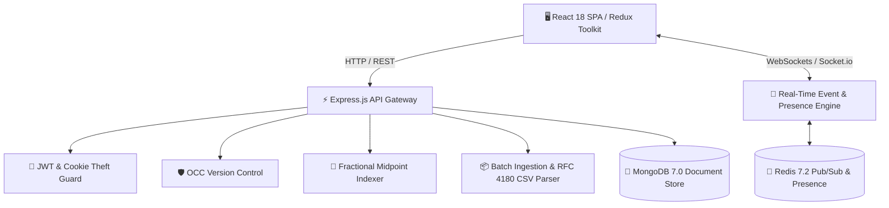

# ⚡ Jira-Lite — Real-Time Collaborative Kanban Tracker


A high-performance, enterprise-grade, real-time collaborative Kanban project management platform designed with modern SaaS aesthetics, micro-animations, and distributed systems resilience.

---

## 🏛️ System Architecture



---

## 🚀 Key Feature Matrix (12-Week Roadmap)

| Milestone | Phase | Key Capabilities |
| :--- | :--- | :--- |
| **`v0.1`** | **Foundation & Architecture** | Monorepo skeleton, Zod env validation, 5 ADRs, ERD models, fractional midpoint position math. |
| **`v0.2`** | **Auth & Security** | JWT 15m access token + 7d rotating HTTP-Only cookie, Token Reuse & Theft Detection, RBAC rank hierarchy. |
| **`v0.3`** | **Projects & Workflows** | Multi-project workspace, custom columns with WIP limits, member invites, column deletion safety guards. |
| **`v0.4`** | **Atomic Tasks & OCC** | Atomic sequence keys (`PROJ-1`), Midpoint reordering, OCC (`409 VERSION_CONFLICT`), soft deletion. |
| **`v0.5`** | **Frontend Core** | React Router v7, silent auth recovery on boot, Redux Entity Adapters, modern auth forms & project dashboard. |
| **`v0.6`** | **Drag & Drop** | `@hello-pangea/dnd` Kanban board, 0ms optimistic updates with automatic rollback, Task detail modal. |
| **`v0.7`** | **Real-Time Collaboration** | Socket.io project rooms, sender-skip (`x-socket-id`), live presence avatars, typing indicators. |
| **`v0.8`** | **Comments & Audit Trail** | Threaded comments, `@mentions`, append-only audit stream, in-app notification center with unread counters. |
| **`v0.9`** | **Filters & Executive Analytics**| Multi-criteria filters (labels, priority, assignees, overdue), project settings modal, Executive Board Analytics. |
| **`v0.10`** | **Import/Export & Bulk Actions** | RFC 4180 CSV/JSON export & batch ingestion, multi-select toolbar (bulk move, bulk priority, bulk delete). |
| **`v0.11`** | **Shortcuts & Themes** | Global keyboard hotkeys (`/`, `C`, `N`, `M`, `?`, `Esc`), Dark/Light mode theme engine, Code splitting. |
| **`v0.12`** | **Production & CI/CD** | Swagger OpenAPI 3.0 (`/api/docs`), multi-stage Dockerfiles, GitHub Actions CI/CD matrix, production hardening. |

---

## ⌨️ Keyboard Shortcuts Reference

| Key | Action | Context |
| :---: | :--- | :--- |
| <kbd>/</kbd> | Focus board search input | Anywhere on board |
| <kbd>C</kbd> or <kbd>N</kbd> | Quick create new task modal | Anywhere on board |
| <kbd>M</kbd> | Toggle card multi-select mode | Anywhere on board |
| <kbd>Del</kbd> or <kbd>Backspace</kbd> | Delete selected tasks | When items are selected |
| <kbd>T</kbd> | Toggle Dark / Light theme | Global |
| <kbd>?</kbd> | Show Shortcuts Cheat Sheet Modal | Global |
| <kbd>Esc</kbd> | Close active modal / clear selection | Global |

---

## 📦 Quickstart & Local Installation

### Prerequisites
- Node.js `>= 20.0.0`
- MongoDB `>= 7.0`
- Redis `>= 7.0` (or Docker)

### Option 1: Run with Docker Compose (Recommended)

```bash
# Clone repository
git clone https://github.com/example/jira-lite.git
cd jira-lite

# Boot full production stack (MongoDB, Redis, Server, Client Nginx)
docker compose -f docker-compose.prod.yml up --build -d
```
Access the client application at `http://localhost` and Swagger API docs at `http://localhost:5000/api/docs`.

### Option 2: Run in Local Development Mode

1. **Start Backend Server:**
   ```bash
   cd server
   cp .env.example .env
   npm install
   npm run dev
   ```

2. **Start Frontend Client:**
   ```bash
   cd ../client
   npm install
   npm run dev
   ```
   Open `http://localhost:5173` in your browser.

---

## 🧪 Comprehensive Test Suites

### Backend Unit & Integration Tests (Jest)
```bash
cd server
npm test
```
- **78 Tests across 9 Suites** (Auth, RBAC, Projects, Tasks, Reordering, Comments, Notifications, Filters, Bulk Operations, Socket.io).

### Frontend Component & Redux Tests (Vitest)
```bash
cd client
npm test -- --run
```
- **10 Unit Tests** (Tasks Slice Optimistic UI, Selectors, UI Theme Engine, Filter Reducers, Notification Badges).

---

## 📖 API Documentation

Interactive Swagger OpenAPI 3.0 documentation is accessible at:
```
http://localhost:5000/api/docs
```

---

## 📄 License
This project is licensed under the MIT License.
