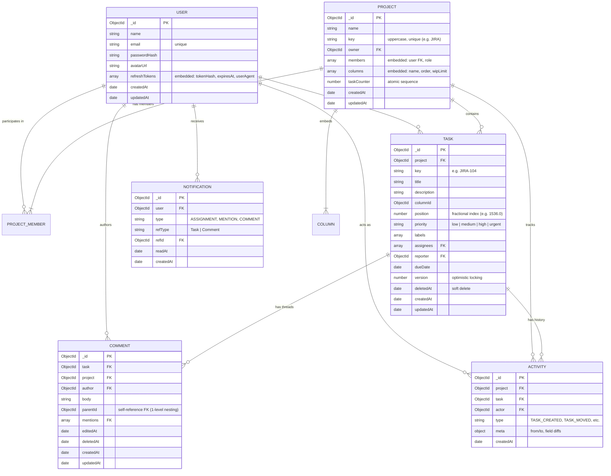

# Data Model & Schema Design: Jira-Lite

## 1. Entity-Relationship Overview

---

## 2. Strategic Schema Decision: Embed vs Reference

| Entity Relationship | Design Strategy | Strategic Reason |
| :--- | :--- | :--- |
| **Project $\rightarrow$ Columns** | **Embedded Array** | A project rarely has more than 5–10 workflow columns. Columns are always read when the board is opened. Embedding guarantees atomic board reads in 1 database roundtrip. |
| **Project $\rightarrow$ Members** | **Embedded Array** | Team sizes per board are bounded (typically 5–50 users). Embedded memberships allow instant RBAC authorization inside the Project document without secondary collection lookups. |
| **Project $\rightarrow$ Tasks** | **Referenced Collection** | Projects contain thousands of tasks over time. Unbounded growth violates MongoDB's 16MB document size limit and makes querying slow. |
| **Task $\rightarrow$ Comments** | **Referenced Collection** | Active discussions grow unboundedly. Independent collection allows cursor-based pagination and threaded sorting without loading entire task blobs. |
| **Project $\rightarrow$ Activity Log** | **Referenced Collection** | Audit logs grow continuously. Stored in an append-only collection with compound index `{ project: 1, createdAt: -1 }` for high-throughput chronological retrieval. |

---

## 3. Database Indexes Specification

### Users Collection (`users`)
- `{ email: 1 }` (Unique): Enforces unique account emails and provides $O(1)$ lookup for authentication.

### Projects Collection (`projects`)
- `{ key: 1 }` (Unique): Ensures project keys (e.g., `PROJ`, `FRONT`) are globally unique and uppercase.
- `{ "members.user": 1 }`: Rapidly filters projects where a specific user is a participant.

### Tasks Collection (`tasks`)
- `{ project: 1, columnId: 1, position: 1 }` (Compound): Critical for sorting tasks in column order during board render and fractional reordering.
- `{ title: "text", description: "text" }` (Text Index): Powers full-text keyword search across project tasks.
- `{ assignees: 1 }`: Fast retrieval of all tasks assigned to a specific team member.
- `{ project: 1, key: 1 }` (Unique): Fast resolution for direct URL routing (e.g. `/projects/JIRA/tasks/JIRA-42`).

### Comments Collection (`comments`)
- `{ task: 1, createdAt: 1 }`: Retrieves chronologically sorted comment threads for the task modal.

### Activity Collection (`activities`)
- `{ project: 1, createdAt: -1 }`: Powers project-level activity stream.
- `{ task: 1, createdAt: -1 }`: Powers task-specific audit trail tab.

### Notifications Collection (`notifications`)
- `{ user: 1, readAt: 1, createdAt: -1 }`: Fast unread notification badge counts (`countDocuments({ user, readAt: null })`) and list queries.
